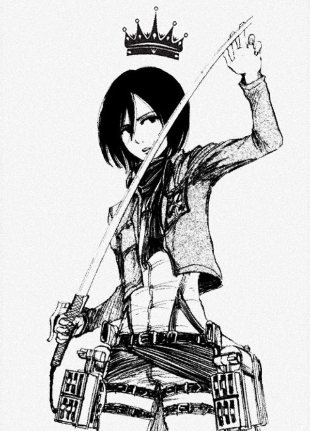

  

  

Olá, me chamo Luana, atualmente estou cursando Análise e Desenvolvimento de Sistemas pela Universidade de São Paulo - Unicid.

---

### 🔭 Estou aprendendo
- Cybersecurity fundamentals
- Operating Systems
- Web Development
- Software Engineering & Quality
- Data Modeling

 

### 💻 Languages

  

---

## 📬 Meus Contatos

---

<h3 align="left">GitHub Stats</h3>

  

<picture align="center">
  <source media="(prefers-color-scheme: dark)" srcset="https://raw.githubusercontent.com/Luuhxd/Luuhxd/output/snake-dark.svg">
  <source media="(prefers-color-scheme: light)" srcset="https://raw.githubusercontent.com/Luuhxd/Luuhxd/output/snake.svg">
  
</picture>
